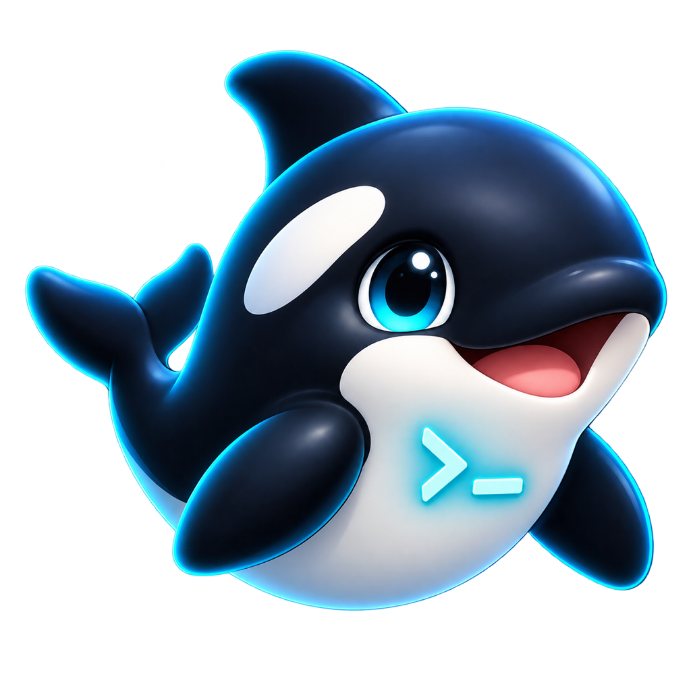

# OrcaPet

**Orcaのエージェント状態を、Codex Petで見える化するデスクトップコンパニオン。**

[](CHANGELOG.md)
[](#対応環境)
[](LICENSE)
[](https://github.com/momuandteasteam/OrcaPet/releases/tag/v0.2.0)



OrcaPetは、Orcaで動いているCodex、Claude Code、OpenCode、Geminiなどの状態をデスクトップPetへ反映します。Codex Pet v2パッケージを変換せず利用でき、プロジェクトごとに別のPetを起動できます。

## できること

- `working`、`waiting`、`review`、`failed`に応じたPetアニメーション
- プロジェクト名、ブランチ、エージェント種類、稼働・完了・未読・端末数の表示
- Codex Pet v2の8列×11行スプライトシートをそのまま利用
- フォルダ、`pet.json`、ZIPからPetをアプリ内インストール
- `~/.codex/pets/`にある既存Petを自動検出
- プロジェクトごとに監視対象、Pet、サイズ設定を分離
- ドラッグ移動、クリック停止、ホバー、ジャンプ、アイドルダッシュ
- macOSのDock／メニューバー、Windowsのタスクトレイに常駐
- 完全ローカル動作。独自のクラウド送信や分析なし

## 対応環境

| OS | 対応状況 | 配布形式 |
|---|---|---|
| macOS Apple Silicon | 対応 | `.app` |
| Windows 10/11 x64 | 対応 | NSIS Setup／Portable `.exe` |
| macOS Intel | ソースからビルド可能 | `.app` |
| Linux | 未対応 | — |

Orca本体と、Codex Pet v2形式のPetパッケージが必要です。配布版には第三者のPet画像を同梱していません。

## クイックスタート

最新版は[GitHub Releases](https://github.com/momuandteasteam/OrcaPet/releases/latest)からダウンロードできます。

### macOS

1. `OrcaPet.app`を`アプリケーション`へ移動します。
2. Orcaを起動します。
3. OrcaPetを起動します。
4. Petを右クリックし、「Petをインストール…」を選択します。

未署名の開発ビルドでは、FinderでControlキーを押しながらアプリをクリックし、「開く」を選択してください。

### Windows

1. `OrcaPet Setup 0.2.0.exe`を実行してインストールするか、Portable版を起動します。
2. Orcaを起動します。
3. タスクトレイにOrcaPetが表示されたことを確認します。
4. Petを右クリックし、「Petをインストール…」を選択します。

SmartScreenが表示された場合は、配布元とファイルを確認してから実行してください。一般配布ではコード署名されたビルドを推奨します。

## Petをインストールする

設定の「Petをインストール…」から、次のいずれかを選ぶだけです。

- Petパッケージのフォルダ
- `pet.json`
- Petを1件含む`.zip`または`.codex-pet`

インストール先は`~/.orcapet/pets/`です。Windowsでは`%USERPROFILE%\.orcapet\pets\`になります。同じIDのPetを更新すると旧版をバックアップします。

既にCodex Desktopへインストール済みなら、`~/.codex/pets/`または`%USERPROFILE%\.codex\pets\`から自動検出されるため、再インストールは不要です。

## 操作

| 操作 | 動作 |
|---|---|
| ドラッグ | Petと情報パネルを一緒に移動 |
| クリック | 走行中のPetを停止 |
| ホバー | Wave |
| ダブルクリック | Jump |
| 右クリック | 設定を開く |
| ×またはEsc | 設定を閉じる |

標準サイズ`1.0`はCodex DesktopのPetに近い大きさです。アイドルが12秒続くと近い画面端まで一度だけ走ります。この動作は設定から無効化できます。

## プロジェクトごとに起動する

Petを右クリックし、「別プロジェクトのPetを起動…」からOrca Worktreeのフォルダを選択します。

macOS:

```sh
open -na /Applications/OrcaPet.app --args --project /path/to/project
```

Windows PowerShell:

```powershell
Start-Process "$env:LOCALAPPDATA\Programs\OrcaPet\OrcaPet.exe" `
  -ArgumentList '--project', 'C:\path\to\project'
```

## 状態の取得方法

OrcaPetはOrca CLIの構造化出力を定期的に読み取ります。

```sh
orca worktree ps --json
```

表示対象はプロジェクト名、ブランチ、エージェント種類、状態と集計値だけです。プロンプト本文、回答本文、ソースコード、APIキーは表示・送信しません。CLIを利用できない場合は、ローカルプロセスの稼働判定へフォールバックします。

## Codex Pet互換性

```text
my-pet/
├── pet.json
└── spritesheet.webp
```

```json
{
  "id": "my-pet",
  "displayName": "My Pet",
  "description": "A desktop companion.",
  "spriteVersionNumber": 2,
  "spritesheetPath": "spritesheet.webp"
}
```

詳細は[Codex Pet互換仕様](docs/PET_FORMAT.md)を参照してください。

## ソースから実行する

```sh
git clone https://github.com/momuandteasteam/OrcaPet.git
cd OrcaPet
npm install
npm start
```

```sh
npm test
npm run check
```

ビルド:

```sh
npm run dist:mac
npm run dist:win
```

## ドキュメント

- [インストールとPetの追加](docs/INSTALLATION.md)
- [Codex Pet互換仕様](docs/PET_FORMAT.md)
- [プライバシーとセキュリティ](docs/PRIVACY.md)
- [トラブルシューティング](docs/TROUBLESHOOTING.md)
- [開発と配布](docs/DEVELOPMENT.md)
- [変更履歴](CHANGELOG.md)

## 制限事項

- 対応するPet形式は現在Codex Pet v2のみです。
- OrcaのCLI出力形式が変更された場合、状態表示が一時的にフォールバックする可能性があります。
- macOS／Windowsの未署名ビルドではOSの警告が表示されます。
- Windows版はmacOS上のクロスビルドと自動テストに加え、Windows実機での最終確認を推奨します。

## ライセンス

OrcaPetのコードは[MIT License](LICENSE)です。読み込むPetの画像・キャラクター・データには、それぞれのライセンスが適用されます。

Orca、Codex、OpenAIとの公式な提携・承認を示すものではありません。
